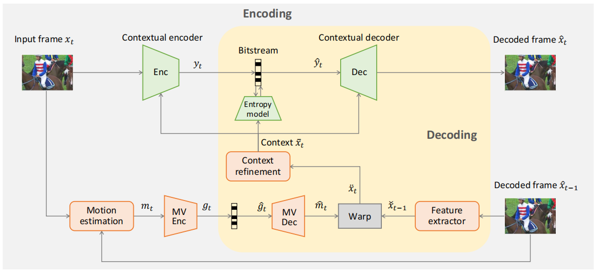
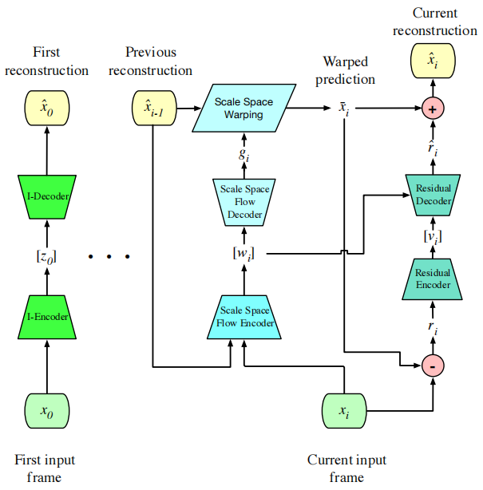
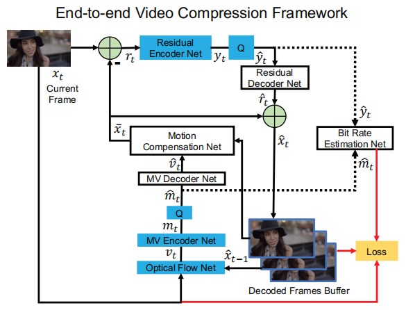
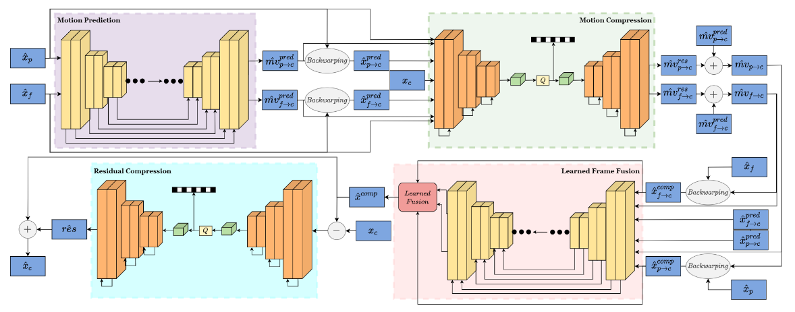

# OpenDMC

OpenDMC is An Open-Source Algorithm Library of Deep-learning-based Multi-frame Coding (DMC). We collect methods on DMC, provide source codes of MindSpore, PyTorch or TensorFlow, and test their performances.
## Contact and References
Coordinator: Asst. Prof. Wei Gao (Shenzhen Graduate School, Peking University)
Should you have any suggestions for better constructing this open source library, please contact the coordinator via Email: gaowei262@pku.edu.cn. We welcome more participants to submit your codes to this collection, and you can send your OpenI ID to the above Email address to obtain the accessibility.

## List of Contributors
Contributors:
Asst. Prof. Wei Gao (Shenzhen Graduate School, Peking University)
Mr. Hua Ye (Peng Cheng Laboratory)
Mr. Yongchi Zhang (Peng Cheng Laboratory)
Mr. Yuyang Wu (Shenzhen Graduate School, Peking University)
etc.
## Table of Content
1.1 DCVC (by Yuyang Wu, Hua Ye)
1.2 ssf2020 (by Yuyang Wu, Hua Ye)
1.3 DVC (by Hua Ye, Yongchi Zhang)
## 1.1 DCVC (by Yuyang Wu, Hua Ye)
- NeurIPS 2021
- In this paper, we propose a deep contextual video compression framework to enable a paradigm shift from predictive coding to conditional coding. In particular, we try to answer the following questions: how to define, use, and learn condition under a deep video compression framework.
- Code in the framework of pytorch & mindspore are available.
- For more information, please go to [DCVC](https://openi.pcl.ac.cn/OpenDMC/Video_Compression_Models).

Figure 1: The framework of DCVC, from Ref. [Li J, Li B, Lu Y. Deep contextual video compression[J]. Advances in Neural Information Processing Systems, 2021, 34: 18114-18125.]
## 1.2 ssf2020 (by Yuyang Wu, Hua Ye)
- CVPR 2020
- In this paper, we show that a generalized warping operator that better handles common failure cases, e.g. disocclusions and fast motion, can provide competitive compression results with a greatly simplified model and training procedure. Specifically, we propose scale-space flow, an intuitive generalization of optical flow that adds a scale parameter to allow the network to better model uncertainty.
- Code in the framework of pytorch & mindspore are available.
- For more information, please go to [ssf2020](https://openi.pcl.ac.cn/OpenDMC/Video_Compression_Models).

Figure 2: Overview of the end-to-end optimized, low-latency compression system, from Ref. [Agustsson E, Minnen D, Johnston N, et al. Scale-space flow for end-to-end optimized video compression[C]//Proceedings of the IEEE/CVF Conference on Computer Vision and Pattern Recognition. 2020: 8503-8512.]
## 1.3 DVC (by Hua Ye, Yongchi Zhang)
- CVPR 2019
- This paper, taking advantage of both classical architecture in the conventional video compression method and the powerful non-linear representation ability of neural networks, proposes the first end-to-end video compression deep model that jointly optimizes all the components for video compression.
- Code in the framework of pytorch & mindspore are available.
- For more information, please go to [DVC](https://openi.pcl.ac.cn/OpenDMC/DVC).

Figure 3: The proposed end-to-end video compression network, from Ref. [Lu G, Ouyang W, Xu D, et al. Dvc: An end-to-end deep video compression framework[C]//Proceedings of the IEEE/CVF Conference on Computer Vision and Pattern Recognition. 2019: 11006-11015.]

## 1.4 DVC_P (by Shangkun Sun, Yongchi Zhang)
- VCIP 2021
- This paper is based on OpenDVC, and improves it with perceptual optimizations (i.e., a discriminator network and a mixed loss are employed to help network trade off among distortion, perception and rate, and nearest-neighbor interpolation is used to eliminate checkerboard artifacts).
- Code in the framework of tensorflow & mindspore are available.
- For more information, please go to [DVC_P](https://openi.pcl.ac.cn/OpenDMC/DVC_P).

Figure 4: The proposed video compression framework of DVC_P, from Ref. [Saiping Zhang, Marta Mrak, Luis Herranz, et al. DVC-P: Deep Video Compression with Perceptual Optimizations[C]// arXiv preprint arXiv:2109.10849.]